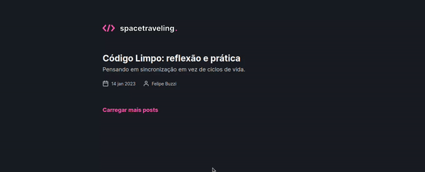

<div align="center" id="top"> 
  

&#xa0;

</div>

<h3 align="center">
Blog SpaceTraveling - Next.js
</h3>

<p align="center">
  <a href="https://rocketseat.com.br">
    
  </a>
  
  <a href="https://www.linkedin.com/in/dev-guilherme-aquino/">
    
  </a>
</p>

&#xa0;

## :rocket: Sobre o projeto

 <p align="center">
 
 </p>
 
SpaceTraveling é um blog sobre tecnologias. A aplicação simula um blog de notícias com o tema a escolha do autor. Os posts são escritos e gerenciados por um sistema de gerenciamento de conteúdo externo (CMS) conectado a aplicação por API.

A aplicação foi desenvolvida usando Next.js e seus dados são servidos pelo CMS Prismic. Além disso, foram adicionados alguns tratamentos de erros para certas situações (dados faltando, API offline, etc).

As páginas da aplicação são construídas usando geração estática com atualizações a cada 5 minuto e utiliza do client-side data fetching para carregar mais posts.

&#xa0;

## Conceitos abordados

- Estados
- Propriedades
- Componentização
- Validação
- SSR e SSG
- API request
- CMS

  &#xa0;

## 💻 Tecnologias

As seguintes ferramentas foram usadas na construção do projeto:

- [Node.js](https://nodejs.org/en/)
- [React](https://pt-br.reactjs.org/)
- [NextJs](https://nextjs.org/)
- [TypeScript](https://www.typescriptlang.org/)
- [SASS](https://sass-lang.com/)
- [Yup](https://github.com/jquense/yup)
- [Prismic](https://prismic.io/)

&#xa0;

## :memo: Pré requisitos

Antes de começar, você precisa ter o [Git](https://git-scm.com) e o [Node](https://nodejs.org/en/) instalados em sua maquina.

Criar uma conta e configurar o serviço do [Prismic CMS](https://prismic.io/)

&#xa0;

## :wrench: Começando

```bash
# Clone este repositório
$ git clone https://github.com/guiaquinodev/spacetraveling


# Entre na pasta
$ cd spacetraveling

# Instale as dependências
$ yarn

# Para iniciar o projeto
$ yarn start

# O app vai inicializar em <http://localhost:3000>
```

&#xa0;

## :thinking: Como contribuir

Se você deseja contribuir com o projeto, basta fazer um fork do repositório, criar uma branch com sua feature, fazer commit das alterações, fazer push para a sua branch e, quando o merge da sua pull request for realizado, deletar a sua branch.

&#xa0;

## 🔖 Layout

Você pode ver o layout do projeto [neste link](https://www.figma.com/file/0Y26j0tf1K2WB5c1ja5hov/Desafios-M%C3%B3dulo-3-ReactJS/duplicate). É necessário ter uma conta no [Figma](https://figma.com) para acessá-lo.

&#xa0;

## ✔️ Licença

Este projeto está sob licença MIT. Veja o arquivo [LICENSE](LICENSE.md) para mais detalhes.

&#xa0;

<div align="center">
Feito com :heart: por <a href="https://github.com/guiaquinodev" target="_blank">Guilherme Aquino</a>
</div>
